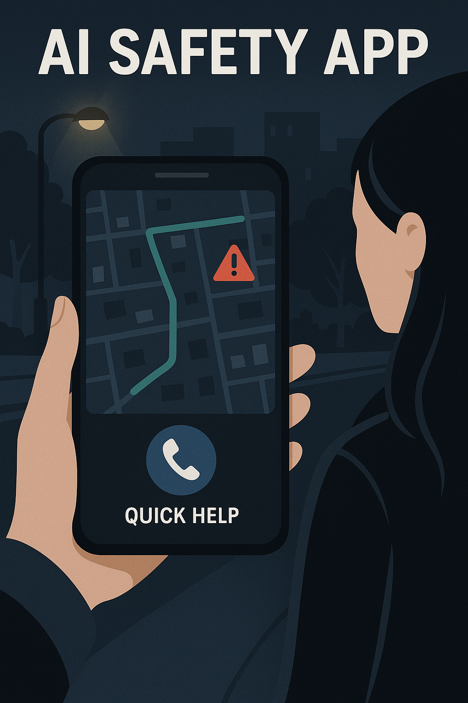
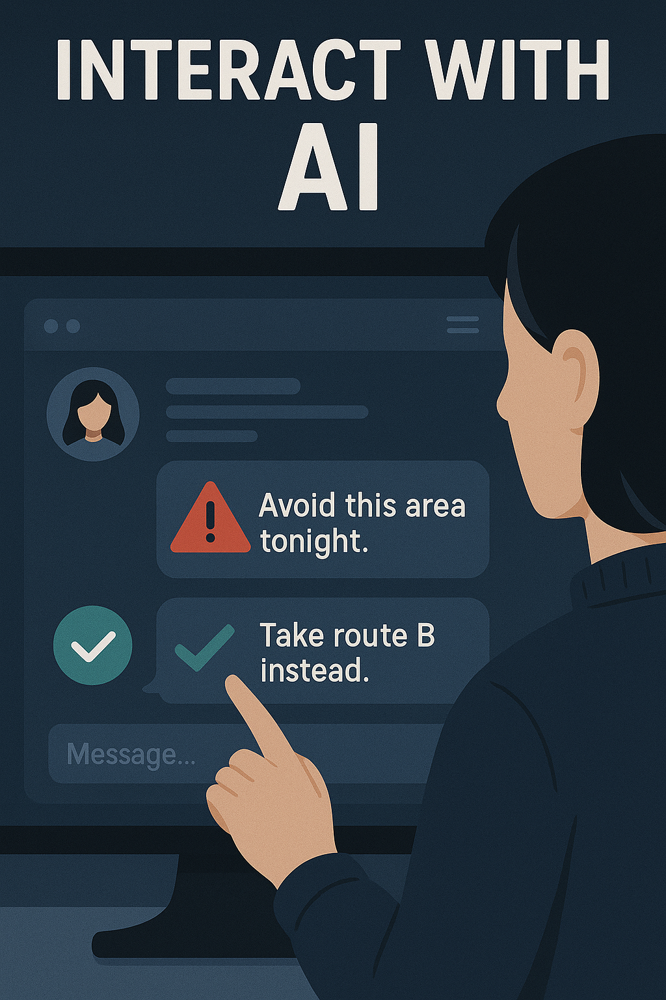

# TryggAI - AI-driven safety assistant for women
*AI-driven safety assistant - prototype, design concept & Building AI course project*

## Table of Contents
- [Summary](#summary)
- [Background](#background)
- [How is the solution used?](#how-is-the-solution-used)
- [Data sources and AI methods](#data-sources-and-ai-methods)
- [Getting started](#getting-started)
- [Usage / How to run](#usage--how-to-run)
- [Acknowledgments](#acknowledgments)
- [License](#license)

## Summary
TryggAI is an AI-driven safety assistant designed to help women feel safer in everyday situations. Through anonymized data, location patterns, and risk analysis, the app provides safer route suggestions, warnings about potentially unsafe areas, and quick access to help when needed.  
**Building AI course project.**



## Background
Many women experience fear or uncertainty when walking alone, especially late at night or in unfamiliar places. Perceived safety is influenced not only by crime statistics but also by how unpredictable or poorly lit environments feel. This project aims to reduce uncertainty and provide women with a tool that strengthens personal safety—without collecting sensitive personal data or enabling surveillance.

Problems addressed:
* lack of real-time information about safer walking routes  
* unclear risk levels in different areas at specific times  
* limited access to discreet help when a situation feels unsafe  

Personal motivation:  
Safety should not be a luxury. Being able to move from point A to point B without fear is fundamental. AI can help create a calmer and more predictable everyday life.

## How is the solution used?



The user opens the app, which displays a safety map built from anonymized data. The app:

* highlights areas with elevated risk indicators (low lighting, incident reports, unusual movement patterns)  
* suggests safer walking paths in real time  
* offers a discreet "quick help" button for contacting a trusted person  
* provides contextual warnings — for example, entering an area with historically higher nighttime risk  

Used when:
* walking home alone  
* waiting for public transport late at night  
* navigating a new neighborhood  
* feeling unsafe and wanting decision support  

## Data sources and AI methods

### Data sources
* Open crime statistics (Swedish Police open data)  
* Lighting levels and streetlight data (municipal open-data portals)  
* Anonymized aggregate mobility data  
* Time-of-day and event-based data  
* Optional user-submitted anonymous safety reports  

Example data resources:
* Swedish Police Open Data: https://polisen.se/om-polisen/om-webbplatsen/oppna-data/  
* Stockholm open-data portal: https://dataportalen.stockholm.se/  

### AI methods
* **Classification:** detecting patterns of elevated risk  
* **Prediction models:** forecasting how risk evolves over time  
* **Clustering:** identifying hotspots triggered by multiple risk factors  
* **Reinforcement learning:** computing the safest route in real time  

In practice, the model prioritizes route segments with better lighting and higher activity levels, while penalizing segments with many past incidents. Each segment receives a risk score based on:

- **Lighting** (dark segments add more risk)  
- **Incident history** (reported incidents increase the score)  
- **Activity level** (empty areas are considered riskier)  

The routing algorithm compares multiple possible paths, sums their segment scores, and selects the path with the **lowest predicted total risk**.

**Risk score example**

- Lighting: dark → +2  
- Incidents: 3 → +1.5  
- Activity: empty → +1  
- **Total risk = 4.5 (elevated risk)**

Machine learning–based prediction adapts to new patterns over time, but requires careful monitoring to avoid reinforcing biases in crime reporting.

## Getting started

To try the prototype:

1. Download or clone this repository.  
2. Ensure you have **Python 3.8+** installed.  
3. Open a terminal in the project folder.  
4. Run the prototype script to generate a simple risk score.

This allows you to test a small component of what a future TryggAI system could use.

## Usage / How to run

### 1. Install Python  
Python 3.8+ recommended.

### 2. Run the prototype script  

```
python prototype/risk_model.py

```
### 3. Expected output  

```
Low lighting, 3 incidents, empty street → risk score: 4.5

```

Explanation:
- lighting = dark (adds +2)  
- incidents = 3 (adds +1.5)  
- activity = empty (adds +1)  

Total = **4.5**, representing an elevated-risk situation.

## Acknowledgments
* Inspired by urban safety research and public-space design  
* Influenced by open-data initiatives and safety mapping projects  
* Images and code examples follow open licenses (Creative Commons / Open Source)  

## License
This project is shared under the **MIT License**, allowing reuse with attribution.
